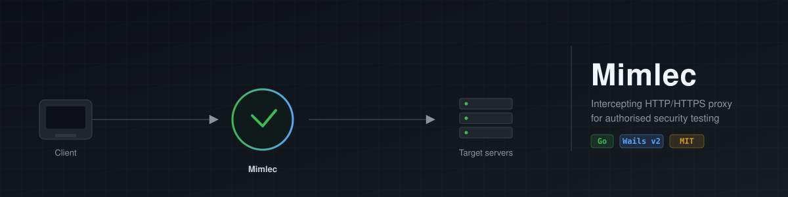

<p align="center">
  
</p>

<p align="center">
  <a href="https://github.com/gorkemguler/Kanca/actions/workflows/ci.yml"></a>
  <a href="https://github.com/gorkemguler/Kanca/blob/main/go.mod"></a>
  <a href="https://github.com/gorkemguler/Kanca/blob/main/LICENSE"></a>
</p>

<p align="center">
  <strong>English</strong> · <a href="README.tr.md">Türkçe</a>
</p>

# Kanca

An intercepting HTTP/HTTPS proxy for **authorised** web-application security
testing — an open, hackable alternative to tools like Burp Suite. Kanca sits
between a browser (or any HTTP client) and the servers it talks to, records
every transaction, and lets you pause, edit, replay and fuzz requests.

> ⚠️ **Authorised use only.** Kanca decrypts and modifies traffic. Use it only
> against systems you own or are explicitly permitted to test. You are
> responsible for complying with all applicable laws and agreements.

## Features (MVP)

| Feature | What it does |
| --- | --- |
| **Intercepting proxy** | Terminates TLS with an on-the-fly per-host certificate signed by a local root CA, so HTTPS traffic can be inspected and modified. |
| **HTTP history** | Every request/response is captured, searchable and filterable, with the full raw bytes of each side. |
| **Interception queue** | Pause requests (and optionally responses), edit the raw bytes, then forward or drop them. |
| **Repeater** | Take any request, tweak it freely, and resend it as many times as you like — each tab keeps its own send history, and a line diff compares a response with the previous send. |
| **Intruder / fuzzer** | Automated payload injection with four attack types (sniper, battering ram, pitchfork, cluster bomb), concurrency control and grep-match highlighting. Payload sets come from a list or a generated numeric range, with per-set processors (URL/base64 encode, upper/lower, MD5/SHA-1/SHA-256). |
| **Target scope** | Restrict recording to chosen hosts (exact, parent-domain or `*.` wildcard); out-of-scope traffic is still proxied but not logged. |
| **Readable bodies** | `gzip`, `deflate` and `brotli` responses are transparently decoded for display, while the proxy forwards the untouched bytes. |
| **Site map** | Captured traffic arranged as a per-host tree of URL paths, so you can see a target's structure rather than a flat log. |
| **Match & replace** | Regex substitutions applied on the wire — rewrite the request line, a header, or the body of outbound requests and inbound responses (Content-Length is kept correct). |
| **Body search** | Filter the history across request/response bodies, not just method/host/path. |
| **Passive scanner** | Flags security issues from observed traffic (missing CSP/HSTS/X-Content-Type-Options, insecure cookies, permissive CORS, version disclosure) without sending any extra requests. |
| **Active scanner** | On demand, sends a small, bounded set of **non-destructive** probes for one request — input reflection and error-based injection indicators — restricted to in-scope hosts. Detection-only: it flags leads to verify by hand, never attempts exploitation. |
| **Save / import / export** | Save a full session (flows, rules, findings, scope) to a project file and reopen it later; export captured traffic as HAR 1.2 and import HAR captures from other tools. |
| **WebSocket support** | `ws://` and `wss://` upgrades are bridged transparently (they used to break, since `Upgrade`/`Connection` are stripped as hop-by-hop for ordinary HTTP) with a live, per-connection frame log — hand-rolled RFC 6455 framing, no dependency. |

## Architecture

The project is split into two Go modules so the engine stays dependency-free
and fully testable, while the desktop shell carries the GUI toolchain.

```
kanca/                      core module — pure Go standard library, no deps
├── internal/
│   ├── cert/               on-the-fly certificate authority (root + leaves)
│   ├── proxy/              the intercepting proxy engine + HTTP wire codec
│   │                       (incl. WebSocket bridging/frame capture)
│   ├── history/            searchable, bounded flow log
│   ├── repeater/           edit-and-resend workspaces
│   ├── intruder/           payload templating + concurrent attack engine
│   ├── rules/              match-and-replace (on-the-wire regex rewrites)
│   ├── scanner/            passive security checks over captured flows
│   ├── activescan/         non-destructive active probes (opt-in, scope-gated)
│   ├── sitemap/            per-host URL path tree built from captured flows
│   ├── diff/               line-oriented text diff (repeater response compare)
│   ├── har/                HAR 1.2 export and import
│   └── project/            save/load a session (flows, rules, findings, scope)
├── cmd/kanca/              headless CLI runner (no GUI required)
└── desktop/                separate module — Wails v2 desktop app
    ├── app.go              Go ↔ frontend bindings
    ├── main.go             Wails entry point
    └── frontend/           React + TypeScript UI (Vite)
```

Because the core module has **zero external dependencies**, it builds and its
tests run anywhere Go is installed — CI needs nothing else.

## Quick start — headless CLI

The CLI runs the full proxy engine without a GUI; handy for servers, CI, or
just verifying things work.

```bash
go run ./cmd/kanca -addr 127.0.0.1:8080
```

Then point your browser's HTTP/HTTPS proxy at `127.0.0.1:8080`. To intercept
HTTPS, export the root CA and import it into your browser/OS trust store:

```bash
go run ./cmd/kanca -export-ca kanca-ca.pem
```

Flags:

| Flag | Default | Meaning |
| --- | --- | --- |
| `-addr` | `127.0.0.1:8080` | proxy listen address |
| `-cadir` | `~/.kanca` | where the root CA is stored |
| `-export-ca PATH` | — | write the root certificate to `PATH` and exit |
| `-insecure-upstream` | `true` | skip verification of upstream server certs |
| `-max-flows` | `100000` | max transactions retained in memory |

## Desktop app

The GUI is a [Wails v2](https://wails.io) application. You need Go, Node.js and
the Wails CLI, plus the platform webview dependencies Wails documents
(e.g. `webkit2gtk` on Linux, WebView2 on Windows).

```bash
go install github.com/wailsapp/wails/v2/cmd/wails@latest

cd desktop
wails dev      # live-reload development
wails build    # produce a native binary in desktop/build/bin
```

On first launch, open **CA / Settings**, import the root certificate into your
browser, set the browser's proxy to the address in the title bar, and press
**Start proxy**.

## Development

```bash
# core engine: build, vet, test (no external deps)
go build ./...
go vet ./...
go test ./...

# frontend type-check + build
cd desktop/frontend && npm install && npm run build
```

The proxy engine is covered by end-to-end tests that stand up real HTTP and
HTTPS backends and drive traffic through the proxy, including interception
drop/edit paths (`internal/proxy/proxy_test.go`).

## Roadmap

Possible future work: authentication/session handling helpers, a built-in
wordlist manager, and out-of-band (OAST) interaction detection.

## License

MIT — see [LICENSE](LICENSE).
