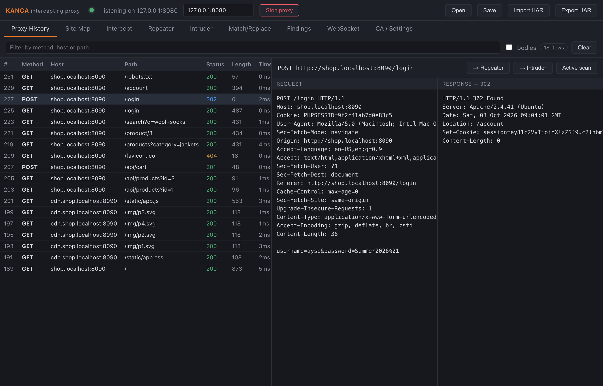
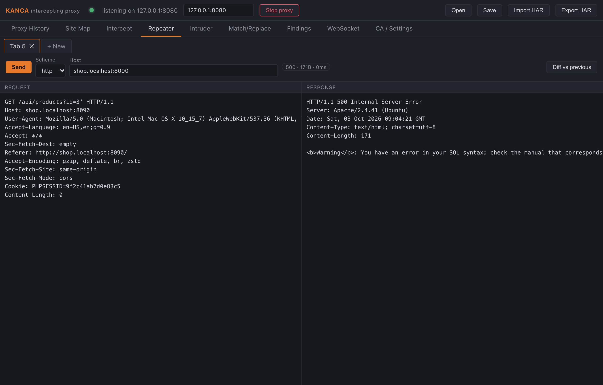
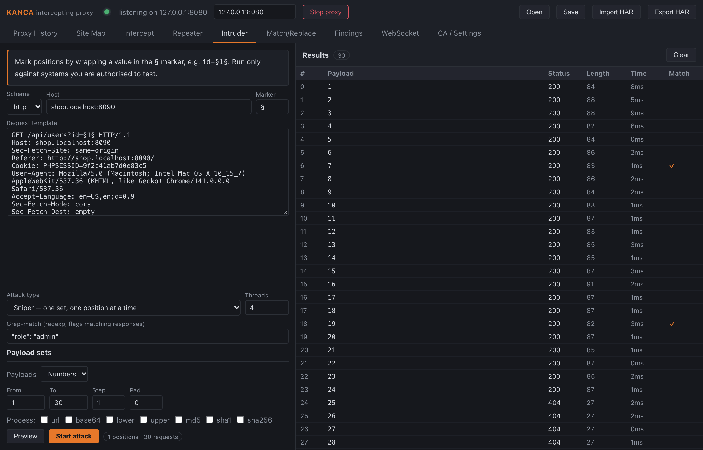
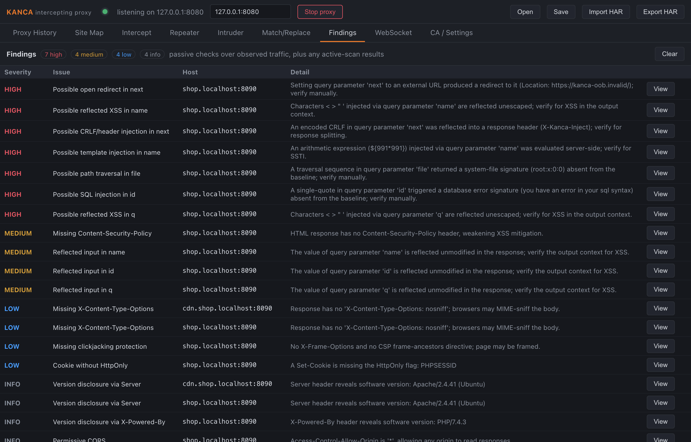
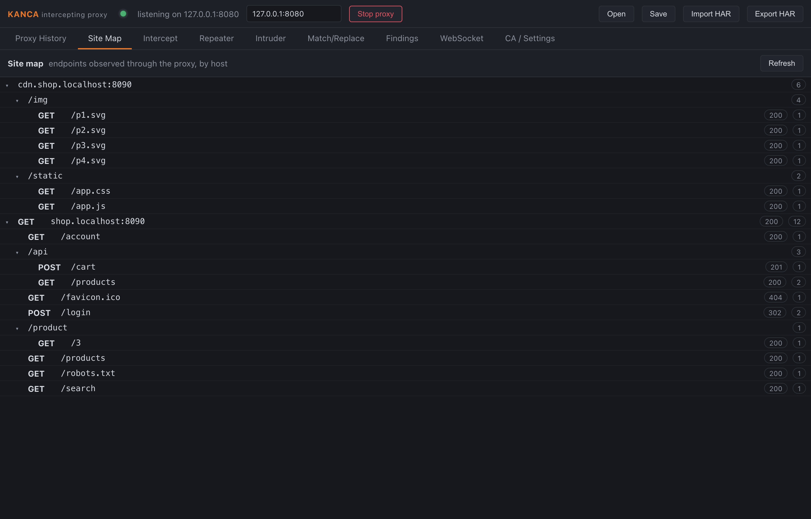

<p align="center">
  
</p>

<p align="center">
  <a href="https://github.com/gorkemguler/Kanca/actions/workflows/ci.yml"></a>
  <a href="https://github.com/gorkemguler/Kanca/blob/main/go.mod"></a>
  <a href="https://github.com/gorkemguler/Kanca/blob/main/LICENSE"></a>
</p>

<p align="center">
  <a href="README.md">English</a> · <strong>Türkçe</strong>
</p>

# Kanca

**Yetkili** web uygulaması güvenlik testleri için araya giren (intercepting)
bir HTTP/HTTPS proxy — Burp Suite gibi araçlara açık ve üzerinde
değişiklik yapılabilir bir alternatif. Kanca, bir tarayıcı (veya herhangi
bir HTTP istemcisi) ile konuştuğu sunucular arasına girer, her isteği/yanıtı
kaydeder ve isteklerinizi duraklatıp düzenlemenize, tekrar göndermenize ve
fuzzlamanıza olanak tanır.

> ⚠️ **Sadece yetkili kullanım içindir.** Kanca trafiği çözer ve değiştirir.
> Yalnızca sahibi olduğunuz veya test etmek için açıkça izin aldığınız
> sistemlere karşı kullanın. Geçerli tüm yasa ve sözleşmelere uymak sizin
> sorumluluğunuzdadır.

## Ekran görüntüleri



<table>
  <tr>
    <td width="50%"><br><sub><b>Repeater</b> — ürün sorgusunu tek tırnakla yeniden göndermek SQL hatasını ortaya çıkarıyor.</sub></td>
    <td width="50%"><br><sub><b>Intruder</b> — 1–30 arası kullanıcı ID'leri taranıyor; grep-match iki admin hesabını işaretliyor.</sub></td>
  </tr>
  <tr>
    <td width="50%"><br><sub><b>Bulgular</b> — pasif header/cookie kontrolleri ve aktif tarama ipuçları (XSS, SQLi, path traversal, SSTI, open redirect, CRLF).</sub></td>
    <td width="50%"><br><sub><b>Site haritası</b> — yakalanan endpoint'ler host bazlı bir ağaç olarak.</sub></td>
  </tr>
</table>

<sub>Ekran görüntüleri, yerelde çalışan ve bilerek zayıf bırakılmış bir demo mağazaya karşı alınmıştır.</sub>

## Özellikler (MVP)

| Özellik | Ne yapar |
| --- | --- |
| **Araya giren proxy** | Yerel bir root CA tarafından imzalanmış, anlık üretilen host bazlı sertifikalarla TLS'i sonlandırır; böylece HTTPS trafiği incelenip değiştirilebilir. |
| **HTTP geçmişi** | Her isteğin/yanıtın her iki tarafının ham baytlarıyla birlikte, aranabilir ve filtrelenebilir şekilde kaydı tutulur. |
| **Interception kuyruğu** | İstekleri (isteğe bağlı olarak yanıtları da) duraklatın, ham baytları düzenleyin, ardından iletin veya düşürün. |
| **Repeater** | Herhangi bir isteği alın, özgürce değiştirin ve istediğiniz kadar tekrar gönderin — her sekme kendi gönderim geçmişini tutar ve satır bazlı diff, bir yanıtı bir önceki gönderimle karşılaştırır. |
| **Intruder / fuzzer** | Dört saldırı tipiyle (sniper, battering ram, pitchfork, cluster bomb) otomatik payload enjeksiyonu, eşzamanlılık kontrolü ve grep-eşleşme vurgulama. Payload setleri bir listeden veya üretilen sayısal bir aralıktan gelir; her set için işlemciler (URL/base64 encode, büyük/küçük harf, MD5/SHA-1/SHA-256) uygulanabilir. |
| **Hedef kapsamı (scope)** | Kaydı seçilen host'larla sınırlandırın (tam eşleşme, üst alan adı veya `*.` joker karakter); kapsam dışı trafik yine proxy'lenir ama kaydedilmez. |
| **Okunabilir gövdeler** | `gzip`, `deflate` ve `brotli` yanıtları görüntüleme için şeffaf biçimde çözülür; proxy ise değiştirilmemiş baytları iletmeye devam eder. |
| **Site haritası** | Yakalanan trafik, düz bir günlük yerine host bazlı bir URL yolu ağacı olarak sunulur; böylece hedefin yapısını görebilirsiniz. |
| **Match & replace** | Hattın üzerinde uygulanan regex değişimleri — giden isteklerin ve gelen yanıtların istek satırını, bir header'ı veya gövdesini yeniden yazın (Content-Length doğru tutulur). |
| **Gövde arama** | Sadece method/host/path değil, istek/yanıt gövdelerinde de geçmişi filtreleyin. |
| **Pasif tarayıcı** | Gözlemlenen trafikten güvenlik sorunlarını işaretler (eksik CSP/HSTS/X-Content-Type-Options, güvensiz cookie'ler, gevşek CORS, sürüm ifşası) — ek bir istek göndermeden. |
| **Aktif tarayıcı** | Talep üzerine, tek bir isteğin insertion point'lerini — query, form gövdesi ve JSON gövdesi parametreleri — yansıyan girdi/XSS, hataya dayalı SQL enjeksiyonu, path traversal, open redirect, template enjeksiyonu (SSTI) ve CRLF/header enjeksiyonu için dener; yalnızca kapsam içindeki host'larla sınırlı. Opt-in bir **agresif** mod, boolean ve time-based SQLi ile time-based komut enjeksiyonu kontrollerini ekler (bunlar hedefi gözlemlenebilir şekilde çalıştırır). Sadece tespit amaçlıdır: her kontrol bir baseline ile karşılaştırma yapar ve elle doğrulanacak bir ipucu işaretler — asla istismar (exploitation) girişiminde bulunmaz. |
| **Kaydet / içe-dışa aktar** | Tam bir oturumu (flow'lar, kurallar, bulgular, kapsam) bir proje dosyasına kaydedip sonra tekrar açın; yakalanan trafiği HAR 1.2 olarak dışa aktarın ve başka araçlardan HAR yakalamalarını içe aktarın. |
| **WebSocket desteği** | `ws://` ve `wss://` upgrade'leri şeffaf biçimde köprülenir (normal HTTP için hop-by-hop olarak `Upgrade`/`Connection` header'ları temizlendiğinden eskiden bu bağlantılar bozulurdu) — canlı, bağlantı başına frame kaydıyla birlikte; sıfırdan yazılmış RFC 6455 framing, harici bağımlılık yok. |

## Mimari

Proje iki Go modülüne ayrılmıştır; böylece engine bağımlılıksız ve tamamen
test edilebilir kalırken, desktop kabuğu GUI araç zincirini taşır.

```
kanca/                      çekirdek modül — saf Go standart kütüphanesi, bağımlılık yok
├── internal/
│   ├── cert/               anlık üretilen sertifika otoritesi (root + leaf sertifikalar)
│   ├── proxy/              araya giren proxy motoru + HTTP wire codec
│   │                       (WebSocket köprüleme/frame yakalama dahil)
│   ├── history/            aranabilir, sınırlı boyutlu flow kaydı
│   ├── repeater/           düzenle-ve-tekrar-gönder çalışma alanları
│   ├── intruder/           payload şablonlama + eşzamanlı saldırı motoru
│   ├── rules/              match-and-replace (hat üzerinde regex yeniden yazımı)
│   ├── scanner/            yakalanan flow'lar üzerinde pasif güvenlik kontrolleri
│   ├── activescan/         yıkıcı olmayan aktif problar (opt-in, kapsamla sınırlı)
│   ├── sitemap/            yakalanan flow'lardan oluşturulan host bazlı URL yolu ağacı
│   ├── diff/               satır bazlı metin diff'i (repeater yanıt karşılaştırması)
│   ├── har/                HAR 1.2 dışa/içe aktarım
│   └── project/            bir oturumu kaydet/yükle (flow'lar, kurallar, bulgular, kapsam)
├── cmd/kanca/              GUI gerektirmeyen headless CLI çalıştırıcı
└── desktop/                ayrı bir modül — Wails v2 desktop uygulaması
    ├── app.go              Go ↔ frontend bağlantıları
    ├── main.go             Wails giriş noktası
    └── frontend/           React + TypeScript arayüz (Vite)
```

Çekirdek modülün **hiçbir harici bağımlılığı olmadığından**, Go'nun kurulu
olduğu her yerde derlenir ve testleri çalışır — CI için başka hiçbir şeye
gerek yoktur.

## Hızlı başlangıç — headless CLI

CLI, GUI olmadan tüm proxy motorunu çalıştırır; sunucularda, CI'da veya
işlerin çalıştığını doğrulamak için kullanışlıdır.

```bash
go run ./cmd/kanca -addr 127.0.0.1:8080
```

Ardından tarayıcınızın HTTP/HTTPS proxy ayarını `127.0.0.1:8080` olarak
belirleyin. HTTPS'i de yakalamak için root CA'yı dışa aktarıp
tarayıcınızın/işletim sisteminizin güven deposuna ekleyin:

```bash
go run ./cmd/kanca -export-ca kanca-ca.pem
```

Bayraklar (flags):

| Bayrak | Varsayılan | Anlamı |
| --- | --- | --- |
| `-addr` | `127.0.0.1:8080` | proxy dinleme adresi |
| `-cadir` | `~/.kanca` | root CA'nın saklandığı yer |
| `-export-ca PATH` | — | root sertifikayı `PATH`'e yazıp çıkar |
| `-insecure-upstream` | `true` | upstream sunucu sertifikalarının doğrulamasını atla |
| `-max-flows` | `100000` | bellekte tutulan azami işlem (transaction) sayısı |

## Desktop uygulaması

GUI bir [Wails v2](https://wails.io) uygulamasıdır. Go, Node.js ve Wails
CLI'nin yanı sıra Wails'in belgelediği platforma özgü webview
bağımlılıklarına ihtiyacınız var (ör. Linux'ta `webkit2gtk`, Windows'ta
WebView2).

```bash
go install github.com/wailsapp/wails/v2/cmd/wails@latest

cd desktop
wails dev      # canlı yeniden yükleme ile geliştirme
wails build    # desktop/build/bin altında native bir binary üretir
```

İlk açılışta **CA / Settings** kısmını açın, root sertifikayı tarayıcınıza
içe aktarın, tarayıcının proxy ayarını başlık çubuğundaki adrese ayarlayın
ve **Start proxy**'ye basın.

## Geliştirme

```bash
# çekirdek motor: derle, vet, test et (harici bağımlılık yok)
go build ./...
go vet ./...
go test ./...

# frontend tip kontrolü + build
cd desktop/frontend && npm install && npm run build
```

Proxy motoru, gerçek HTTP ve HTTPS backend'ler ayağa kaldırıp trafiği
proxy üzerinden geçiren uçtan uca testlerle kapsanır; interception'da
düşürme/düzenleme yolları da dahildir (`internal/proxy/proxy_test.go`).

## Yol haritası

Olası gelecek çalışmalar: kimlik doğrulama/oturum yönetimi yardımcıları,
yerleşik bir wordlist yöneticisi ve bant dışı (OAST) etkileşim tespiti.

## Lisans

MIT — bkz. [LICENSE](LICENSE).
